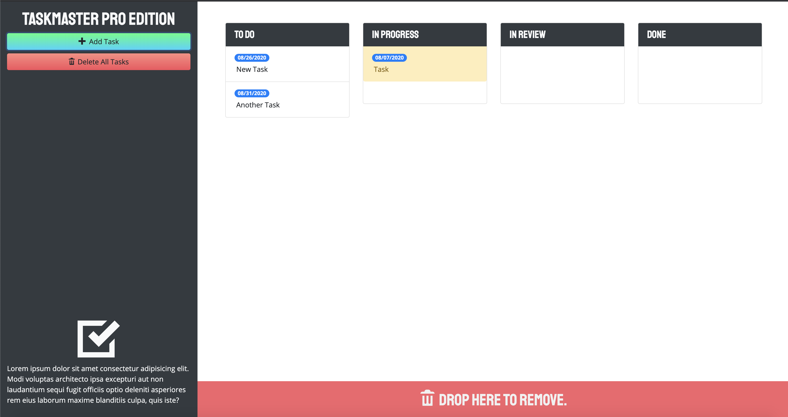

# Task Master Pro 

## Description 
This project is a task-management application using JavaScript and jQuery to manipulate the DOM. It also utilizes Bootstap as the CSS framework. Task data is persistent using localStorage.

## Table of Contents
* [Installation](#installation)
* [Usage](#usage)
* [License](#license)
* [Contributing](#contributing)
* [Tests](#tests)
* [Questions](#questions)

## Installation 
The user should clone the repository from GitHub and open up the project in the browser from the index file.

## Usage 
This application will allow users to create tasks with descriptions and due dates. Users also are able to drag and drop tasks based on their process and can delete any task. 
Please view deployed application on [Git Hub Pages](https://nicolewallace09.github.io/taskmaster-pro/) 

## License 
This project is license under MIT

## Contributing 
Contributors should read the installation section. 

## Tests
There are no tests for this application. 

## Questions
If you have any questions about this projects, please contact me directly at nicole.elisaw@gmail.com. You can view more of my projects at https://github.com/nicolewallace09.